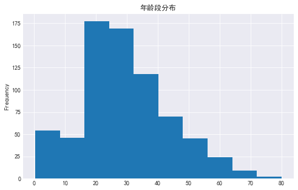
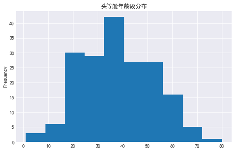
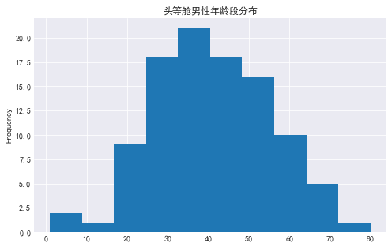
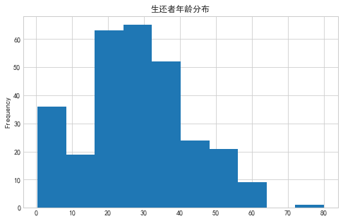
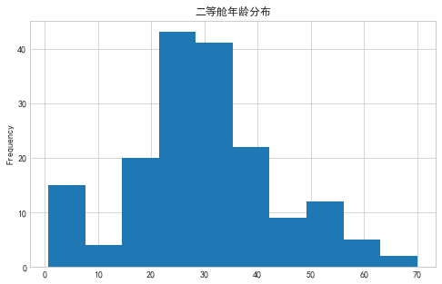
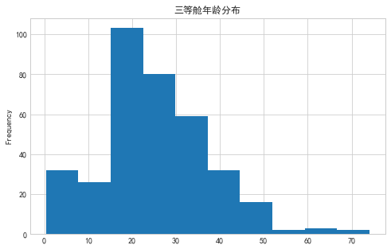
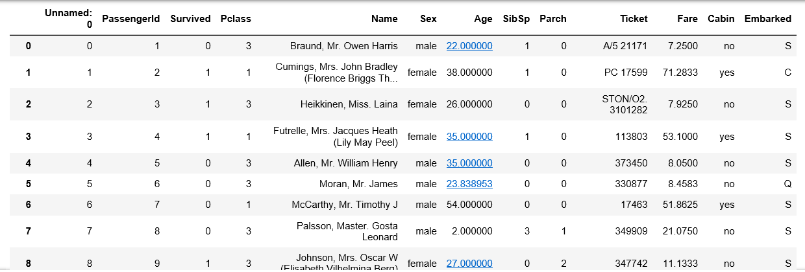
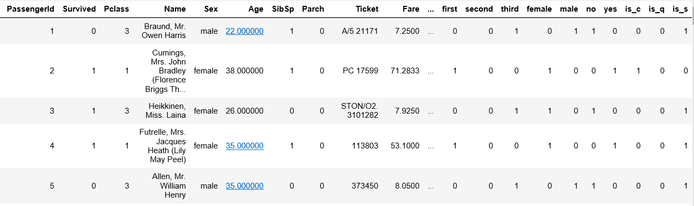
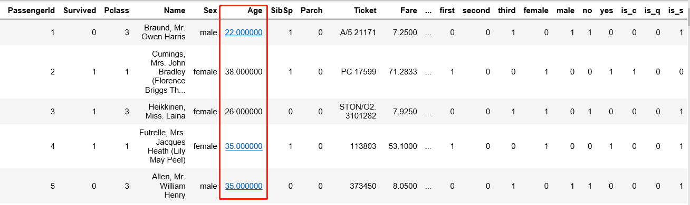

# kaggle-泰坦尼克生还率预测
[项目飞机票](https://www.kaggle.com/c/titanic):airplane:

``` python
import pandas as pd
import numpy as np
import matplotlib as plot
import matplotlib.pyplot as plt
from collections import Counter
import seaborn as sn
sn.set_style('darkgrid')
from pyecharts import Bar
from pyecharts import Pie
from pyecharts import Boxplot
import statsmodels.api as sm
```
1.了解数据

`df.info()`

`df.describe()`


### 对原始数据基础描述：
- 描述一
  - Age(年龄)存在小部分缺失值
  - Cabin(客舱)存在大量缺失值
  - Embarked(登船口)存在不明显的缺失值（这事可以先放放）
- 描述二
  - 生还率0.38
  - 平均年龄 29.70
  - 票价均数32.20，中位数14.45（偏位）
  - 最低票价为零（可以作为后期建模的一个特征）

以下分别对上面提到的字段进行下简单的查看
``` python
one_sur_male = len(df.query('Pclass == 1').query('Sex == "male"').query('Survived == 1'))/len(df.query('Pclass == 1').query('Sex == "male"'))
one_sur_male = round(one_sur_male,2)
one_sur_male
one_sur_female = len(df.query('Pclass == 1').query('Sex == "female"').query('Survived == 1'))/len(df.query('Pclass == 1').query('Sex == "female"'))
one_sur_female = round(one_sur_female,2)
one_sur_female
two_sur_male = len(df.query('Pclass == 2').query('Sex == "male"').query('Survived == 1'))/len(df.query('Pclass == 2').query('Sex == "male"'))
two_sur_male = round(two_sur_male,2)
two_sur_male
two_sur_female = len(df.query('Pclass == 2').query('Sex == "female"').query('Survived == 1'))/len(df.query('Pclass == 2').query('Sex == "female"'))
two_sur_female = round(two_sur_female,2)
two_sur_female
three_sur_male = len(df.query('Pclass == 3').query('Sex == "male"').query('Survived == 1'))/len(df.query('Pclass == 3').query('Sex == "male"'))
three_sur_male = round(three_sur_male,2)
three_sur_male
three_sur_female = len(df.query('Pclass == 3').query('Sex == "female"').query('Survived == 1'))/len(df.query('Pclass == 3').query('Sex == "female"'))
three_sur_female = round(three_sur_female,2)
three_sur_female
index_list = ['一等舱','二等舱','三等舱']
male_list = [one_sur_male,two_sur_male,three_sur_male]
female_list = [one_sur_female,two_sur_female,three_sur_female]
bar = Bar('各仓位男女生还率对比')
bar.add('女性',index_list,female_list,mark_line=['average'],mark_point=['max','min'])
bar.add('男性',index_list,male_list,mark_line=['average'],mark_point=['max','min'])
bar
```

<br>**看下年龄段的分布**<br>
`df.Age.plot(kind='hist',title='年龄段分布',figsize=(8,5))`

<br>**ok... 看起来大部分年龄集中在 18--40 岁，这很符合我对《泰坦尼克号》的印象，年轻人不仅镜头多而且实际上也是主体**:relaxed:<br>
<br>**Ummmm.. 我特别想知道住头等舱的 “上流人士” 年龄组成，看看那些Gentleman and Lady是否集中在意气风发的中年**<br>
`df.query('Pclass == 1').Age.plot(kind='hist',title='头等舱年龄段分布',figsize=(8,5))`

<br>**... 瞅着大体年龄段平均且丰富，较为集中在 18--55岁，35--42有峰值，也确实比总体年龄趋于大龄化，可这样子还是让我感到很奇怪，18--55中除去峰值那里，剩下的太过平均，我觉得不对劲，仔细回忆了下影片的细节:neckbeard:so... 我决定**<br>
**。。。**
<br>**单独看下gentleman的**<br>
`df.query('Pclass == 1').query('Sex == "male"').Age.plot(kind='hist',title='头等舱男性年龄段分布',figsize=(8,5))`

<br>**that's great!这符合我的猜测，同样的35--42峰值，峰值前梯度上升，峰值后梯度递减，原因不重要**<br>

## 二更。。。<br>
虽然之前提到对头等舱男性的猜测得到了一个自我满足式的验证，可这不代表正确，有时候数据真的很会说谎，那么怎么验证更有说服力呢？恐怕要就数据和我们研究的具体内容下定论了，刚刚的头等舱男士年龄事实上是否真的集中在中年，那么我们可以出门左拐去看看历史文献或记录片吧啦吧啦。。。<br><br>
废话不多说，各位看官咱接着往下走:smiley_cat:<br><br>
虽说啊，这个年龄段分布大体上是看过了，可是对于年龄上的探索我可还不满足，谁叫它缺失值太多了，叫人寝食难安夜不能寐，这么大比例的缺失值丢掉很可能直接影响结果的准确性，所以得想方设法找个由头给它们填充上，**so** 我决定接着和大家絮叨几张图<br>
这个是生还者年龄段分布，最起码也要看看哪个年龄段获救占总获救的比重更大不是<br>
`df.query('Survived == 1').Age.plot(kind='hist',title='生还者年龄分布',figsize=(8,5));`
`sn.set_style(style='whitegrid')`<br>
<br>
这样两块明显区域貌似清晰了多，0 ~ 10，18 ~ 40.虽说事件臭名昭著，但从结果数据来看，妇女儿童优先不是说说而已了（**妇女优先**请看开始的**各舱位男女生还率对比**）
最后是各舱位年龄分布，头等舱的图在最开始的位置，这里只放二等舱与三等舱的。<br>

<br>
看样子舱位等级越高平均年龄也越大，所以嘛，每个大佬也都是从年轻屌丝过来滴，稳扎稳打与君共勉。<br>
到这为止，年龄上的探索告一段落吧，不过在这里可以告诉大家，在这次的年龄缺失值的填充上并没有使用到上述内容所带来的信息。**求都妈得！各位看官先别激动**:fire:，上述的信息可谓是对我第二次提交预测集起到了莫大的作用，这个暂时还急不得，容在下卖个关子小抖个机灵.<br>
那~老少爷们们,咱们在往下遛遛？<br>
## 前面絮叨了太多，下面开始正题。<br>
目前的数据集长这样，仅仅是拟合了下年龄对缺失的年龄进行的填充<br>
<br>
下面我需要对其它的特征采取点措施了，这么多的分类变量最先让我想到的就是因子化了。<br>
通过把类别返回成`0`或`1`，放入我们之后的分类器中。其中`1`表`是`,`0`表`否`。<br>
让我们再回到数据中看看，能够进行特征因子化的变量有`Pclass`,`Sex`,`Cabin`,`Embarked`。<br>
```python
df[['first','second','third']] = pd.get_dummies(df.Pclass)
df[['female','male']] = pd.get_dummies(df.Sex)
df[['no','yes']] = pd.get_dummies(df.Cabin)
df[['is_c','is_q','is_s']] = pd.get_dummies(df.Embarked)
```
查看下结果<br>

<br>
哼哼~很不错，所有给出的的分类变量都让我们因子化了。下面再考虑要做点什么呢？<br>
我的目光再次盯到`Age`上，直觉告诉我我们之间还会有故事。<br>
那就是标准化啦，我们所挑选准备放到分类器中的特征都是我们刚刚因子化得出的`0`或`1`。<br>
倘若我把`Age`一并放入会怎样？先看下我们之前所做的因子化的变量，所有经过因子化的变量的方差都在`0~1`之间，我们看下`Age`这一列的值。<br>
<br>
普遍都为两位数，如果加入了未处理的`Age`会怎样呢？该变量的方差为170，我们了解回归拟合原理是用到了最小二乘法的，可想而知单个变量170的方差会对一堆`0~1`方差变量的拟合造成怎样的影响！<br>
