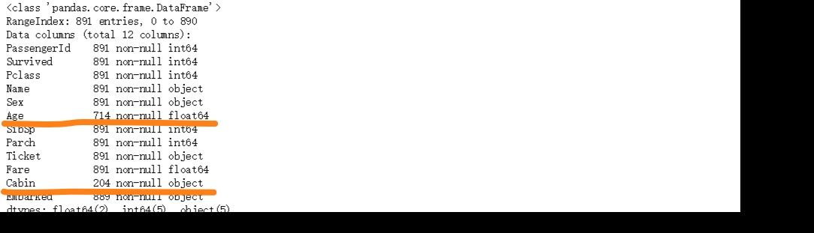
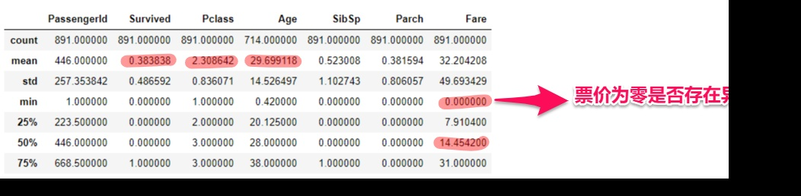

# kaggle-泰坦尼克
[项目飞机票](https://www.kaggle.com/c/titanic):airplane:

``` python
import pandas as pd
import numpy as np
import matplotlib as plot
import matplotlib.pyplot as plt
from collections import Counter
import seaborn as sn
import seaborn as sn
sn.set_style('darkgrid')
from pyecharts import Bar
from pyecharts import Pie
from pyecharts import Boxplot
import statsmodels.api as sm
```
1.了解数据

`df.info()`

`df.describe()`


### 对原始数据基础描述：
- 描述一
  - Age(年龄)存在小部分缺失值
  - Cabin(客舱)存在大量缺失值
  - Embarked(登船口)存在不明显的缺失值（这事可以先放放）
- 描述二
  - 生还率0.38
  - 平均年龄 29.70
  - 票价均数32.20，中位数14.45（偏位）
  - 最低票价为零（目前不排除异常值的可能，这事也不着急
``` python
one_sur_male = len(df.query('Pclass == 1').query('Sex == "male"').query('Survived == 1'))/len(df.query('Pclass == 1').query('Sex == "male"'))
one_sur_male = round(one_sur_male,2)
one_sur_male
one_sur_female = len(df.query('Pclass == 1').query('Sex == "female"').query('Survived == 1'))/len(df.query('Pclass == 1').query('Sex == "female"'))
one_sur_female = round(one_sur_female,2)
one_sur_female
two_sur_male = len(df.query('Pclass == 2').query('Sex == "male"').query('Survived == 1'))/len(df.query('Pclass == 2').query('Sex == "male"'))
two_sur_male = round(two_sur_male,2)
two_sur_male
two_sur_female = len(df.query('Pclass == 2').query('Sex == "female"').query('Survived == 1'))/len(df.query('Pclass == 2').query('Sex == "female"'))
two_sur_female = round(two_sur_female,2)
two_sur_female
three_sur_male = len(df.query('Pclass == 3').query('Sex == "male"').query('Survived == 1'))/len(df.query('Pclass == 3').query('Sex == "male"'))
three_sur_male = round(three_sur_male,2)
three_sur_male
three_sur_female = len(df.query('Pclass == 3').query('Sex == "female"').query('Survived == 1'))/len(df.query('Pclass == 3').query('Sex == "female"'))
three_sur_female = round(three_sur_female,2)
three_sur_female
index_list = ['一等舱','二等舱','三等舱']
male_list = [one_sur_male,two_sur_male,three_sur_male]
female_list = [one_sur_female,two_sur_female,three_sur_female]
bar = Bar('各仓位男女生还率对比')
bar.add('女性',index_list,female_list,mark_line=['average'],mark_point=['max','min'])
bar.add('男性',index_list,male_list,mark_line=['average'],mark_point=['max','min'])
bar
```

<br>**看下年龄段的分布**<br>
`df.Age.plot(kind='hist',title='年龄段分布',figsize=(8,5))`

<br>**ok... 看起来大部分年龄集中在 18--40 岁，这很符合我对《泰坦尼克号》的印象，年轻人不仅镜头多而且实际上也是主体**:relaxed:<br>
<br>**Ummmm.. 我特别想知道住头等舱的 “上流人士” 年龄组成，看看那些**<br>
`df.query('Pclass == 1').Age.plot(kind='hist',title='头等舱年龄段分布',figsize=(8,5))`

<br>**... 瞅着大体年龄段平均且丰富，较为集中在 18--55岁，35--42有峰值，也确实比总体年龄趋于大龄化，可这样子的**<br>
`df.query('Pclass == 1').query('Sex == "male"').Age.plot(kind='hist',title='头等舱男性年龄段分布',figsize=(8,5))`

