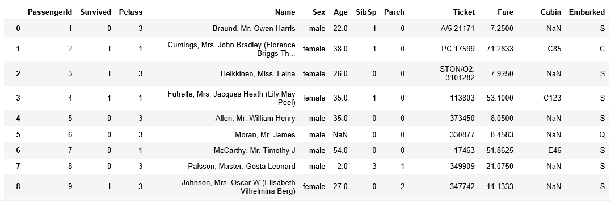
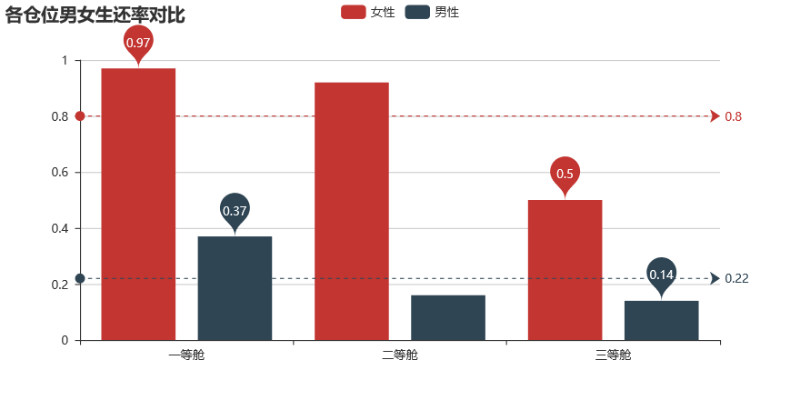

# kaggle-泰坦尼克生还率预测
[项目飞机票](https://www.kaggle.com/c/titanic):airplane:

## 1.导入数据
``` python
import pandas as pd
import numpy as np
import matplotlib as plot
import matplotlib.pyplot as plt
from collections import Counter
import seaborn as sn
sn.set_style('darkgrid')
from pyecharts import Bar
from pyecharts import Pie
from pyecharts import Boxplot
import statsmodels.api as sm
```
`df.head(9)`

`df.info()`

`df.describe()`


### 对原始数据基本描述：
- 描述一
  - Age(年龄)存在小部分缺失值
  - Cabin(客舱)存在大量缺失值
  - Embarked(登船口)存在不明显的缺失值（这事可以先放放）
- 描述二
  - 生还率0.38
  - 平均年龄 29.70
  - 票价均数32.20，中位数14.45（偏位）
  - 最低票价为零（可以作为后期建模的一个特征）

## 2.数据探索
``` python
one_sur_male = len(df.query('Pclass == 1').query('Sex == "male"').query('Survived == 1'))/len(df.query('Pclass == 1').query('Sex == "male"'))
one_sur_male = round(one_sur_male,2)
one_sur_male
one_sur_female = len(df.query('Pclass == 1').query('Sex == "female"').query('Survived == 1'))/len(df.query('Pclass == 1').query('Sex == "female"'))
one_sur_female = round(one_sur_female,2)
one_sur_female
two_sur_male = len(df.query('Pclass == 2').query('Sex == "male"').query('Survived == 1'))/len(df.query('Pclass == 2').query('Sex == "male"'))
two_sur_male = round(two_sur_male,2)
two_sur_male
two_sur_female = len(df.query('Pclass == 2').query('Sex == "female"').query('Survived == 1'))/len(df.query('Pclass == 2').query('Sex == "female"'))
two_sur_female = round(two_sur_female,2)
two_sur_female
three_sur_male = len(df.query('Pclass == 3').query('Sex == "male"').query('Survived == 1'))/len(df.query('Pclass == 3').query('Sex == "male"'))
three_sur_male = round(three_sur_male,2)
three_sur_male
three_sur_female = len(df.query('Pclass == 3').query('Sex == "female"').query('Survived == 1'))/len(df.query('Pclass == 3').query('Sex == "female"'))
three_sur_female = round(three_sur_female,2)
three_sur_female
index_list = ['一等舱','二等舱','三等舱']
male_list = [one_sur_male,two_sur_male,three_sur_male]
female_list = [one_sur_female,two_sur_female,three_sur_female]
bar = Bar('各仓位男女生还率对比')
bar.add('女性',index_list,female_list,mark_line=['average'],mark_point=['max','min'])
bar.add('男性',index_list,male_list,mark_line=['average'],mark_point=['max','min'])
bar
```

<br>**就图像来看，这次的海难能充分的体现出Ladies first，男女生还率按舱级递减，大致get到了当时的情形，灾难面前人们保护的最珍贵的女人和孩子，部分有社会地位的人还是享受到了救援的"优先权"**<br>
<br>**看下各舱位年龄段的分布**<br>
```python
plt.figure(figsize=(12,7))
df.query('Pclass == 1').Age.plot(kind='hist',color='red',histtype='step',label='一等舱')
df.query('Pclass == 2').Age.plot(kind='hist',color='blue',histtype='step',label='二等舱')
df.query('Pclass == 3').Age.plot(kind='hist',color='black',histtype='step',label='三等舱')
plt.title('舱位等级年龄分布')
plt.xlabel('Age')
plt.ylabel('amount')
plt.legend()
plt.show()
```


<br>**emm...，可以看到三等舱的旅客年龄更加的集中于15 ~ 37 区间段，二等舱大致与三等舱主体分布相同，不过稍稍向x轴右边移动了些貌似为 14 ~ 42，一等舱较为独特的是看起来没有较为突出的年龄区间，看到32 ~ 40部分稍稍凸起且两侧对称，估计平均年龄在36左右，这很符合我对《泰坦尼克号》的印象，年轻人不仅镜头多而且实际上也是主体，另外，随着舱位等级的增加，平均年龄也会随之增加，也很好的体现出经济能力在某种程度上受年龄的影响**:relaxed:<br>
<br>**那么年龄与生还率有没有关系呢？要知道现在初步试探的一切不仅是要我们对数据有个清晰的认识，同样也是方便我们挑出一些影响最终生还率的特征方便我们训练模型，废话不多说，继续上代码**<br>
```python
plt.figure(figsize=(14,8))
survived = df[df.Age.notnull()].query('Survived == 1').Age.plot(kind='hist',color='red',bins=70,label='幸存')
un_survived = df[df.Age.notnull()].query('Survived == 0').Age.plot(kind='hist',color='blue',alpha=0.5,bins=70,label='遇难')
plt.title('幸存与遇难对比图')
plt.xlabel('Age')
plt.ylabel('amount')
plt.legend()
plt.show()
```

<br>**貌似有迹可循哦！直观的来看中间大部分红色区域被蓝色区域给覆盖掉了，说明这部分死亡率是大于存活率的，不过0 ~ 15之间的红色区域异常的显眼，这部分为0~15岁的儿童，回溯之前的各舱位男女生还比率来讲，这种情形在意料之中。**<br>
<br>**看过了性别、年龄这两个特征，那么剩下可供我们初步查看的有`SibSp`(兄弟姐妹/配偶)、`Parch`(父母/孩子)、`Fare`(票价)、`Cabin`(房间号)、`Embarked`(登船口)，那么我继续做出各个特征与生还率之间的关系**<br>
<br>**这里呢我把`SibSp`、`Parch`相加到了一起生成一列新的特征`family`，下面我就以`family`为自变量，生还率为因变量来展示，但是为了更好的做出解释，我另加了一个不同的family人数与数量关系图**<br>
```python
df['family'] = df['SibSp'] + df['Parch']
kind = sorted(list(df.family.value_counts().index))
proportion_list = []
for i in kind:
    proportion = len(df.query('family == {}'.format(i)).query('Survived == 1')) / len(df.query('family == {}'.format(i)))
    proportion_list.append(proportion)
plt.figure(figsize=(12,7))
sn.barplot(x=kind,y=proportion_list)
plt.title('family与生还率')
plt.xlabel('family')
plt.ylabel('生还率');
```

<br>**横轴是family的所有个数类型，这里我没有把乘客自身加到里面，那么从得出的图像来讲family为7、10的生还率均为零，family等于3的生还率最高，比较有趣的是当family分别为4、5、7、8的时候我以为从4之后随着family人数增加生还率也会随之降低，但是family等于6的时候生还率出现的明显的增高。这是为什么呢？各位来看下图**<br>
<br>照例先上代码<br>
```python
family_type = df.family.value_counts().index
family_amount = df.family.value_counts().values
plt.figure(figsize=(12,7))
sn.barplot(x=family_type,y=family_amount)
plt.title('family与数量')
plt.xlabel('family')
plt.ylabel('数量');
```

<br>**该图展示了各个种类family的数量，可以看到当family等于0占据了相当大的一部分，family 3 ~ 10在总体的比重相当的低，所以目标群体越小越不能排除偶然性，既然这样，我就把family等于6的乘客单独拿出来看看**<br>
<br>
`df.query('family == 6').query('Survived == 1')`
<br>

<br><br>
<br>**短短的四条数据蕴含着很多我们之前没有挖掘的信息，首先`Name`特征下，三个那个...英国人的命名我不太清楚，所以我去简单查了下，英语姓名的一般结构为：教名+自取名+姓，具体就不继续考究了，总之三个教名`Asplund`一模一样，再来看看`SibSp`(兄弟姐妹/配偶)、`Parch`(父母/孩子)两个特征，数量上面让我又觉得好像有某种联系，再来看下`Fare`(票价)，给我强烈的感觉认为她们是一家人，并且可能买的是团体票，关于票价的分布状态后面我会放出来。另外她们三个的票号也是一样的`Ticket`！**<br><br>
<br>**那么现在明了了，这些是一个特殊的群体，她们面临着不利因素，家庭群体大，由之前的各类family生还率能推测，结果的生还率没有family为0、1、2、3的大，舱位等级三等舱，但同时她们有掌握着有利因素，`Sex`特征下female为主体、`Age`特征下有着3岁和5岁的baby，最终的结果影响了family为6时的生还率#family为6的乘客一共12人**<br>
<br>**接着是`Fare`(票价)，我分别按船舱等级进行票价的展示**<br>
```python
df_first = df.query('Pclass == 1')
plt.figure(figsize=(15,8))
df_first.query('Survived == 1').query('200 > Fare ').Fare.plot(kind='hist',color='red',bins=150,label='幸存')
df_first.query('Survived == 0').query('200 > Fare ').Fare.plot(kind='hist',color='blue',alpha=0.5,bins=150,label='遇难')
plt.title('票价与生存情况(一等舱)')
plt.xlabel('Fare(票价)')
plt.legend()
plt.ylabel('人数');
```

```python
df_two = df.query('Pclass == 2')
plt.figure(figsize=(15,8))
df_two.query('Survived == 1').query('200 > Fare ').Fare.plot(kind='hist',color='red',bins=150,label='幸存')
df_two.query('Survived == 0').query('200 > Fare ').Fare.plot(kind='hist',color='blue',alpha=0.5,bins=150,label='遇难')
plt.title('票价与生存情况(二等舱)')
plt.xlabel('Fare(票价)')
plt.legend()
plt.ylabel('人数');
```

```python
df_three = df.query('Pclass == 3')
plt.figure(figsize=(15,8))
df_three.query('Survived == 1').query('200 > Fare ').Fare.plot(kind='hist',color='red',bins=150,label='幸存')
df_three.query('Survived == 0').query('200 > Fare ').Fare.plot(kind='hist',color='blue',alpha=0.5,bins=150,label='遇难')
plt.title('票价与生存情况(三等舱)')
plt.xlabel('Fare(票价)')
plt.legend()
plt.ylabel('人数');
```

<br>
**对比了这三张图片，直观的看，红色的面积会随着舱位等级的增加随之会减小,反之蓝色的面积会增加。说明票价对存活是有一定的影响的，至于上面所说为什么票价在分类器中无作用，这里我只能先卖个关子，各位不妨先猜一猜。**<br><br>
**关于`Cabin`(房间号)在开始存在大量的缺失值，貌似不能进行过多的探索**

<br>**不过最起码我们可以把房间号分为两类，`有房间号`与`无房间号`，同样的把这两类的生还人数与死亡人数拉出来对比一下**
```python
Survived_yes = df_orginal[~df_orginal.Cabin.isnull()].query('Survived == 1').shape[0]
died_yes = df_orginal[~df_orginal.Cabin.isnull()].query('Survived == 0').shape[0]
Survived_no = df_orginal[df_orginal.Cabin.isnull()].query('Survived == 1').shape[0]
died_no = df_orginal[df_orginal.Cabin.isnull()].query('Survived == 0').shape[0]
plt.figure(figsize=(8,6))
plt.bar('有房间号',Survived_yes,label = 'Survived',color = 'red',bottom = died_yes)
plt.bar('有房间号',died_yes,label = 'died',color = 'blue')
plt.bar('无房间号',died_no,color = 'blue',bottom = Survived_no)
plt.bar('无房间号',Survived_no,color = 'red')
plt.legend();
```

<br>**从图像上我们可以看到`有房间号`与`无房间号`，在生还比例上有着截然相反的差异，有房间号的生还率更加的大一些，为此我们可以把`Cabin`当做一个重要特征来对待**<br><br><br>
**现在只剩下`Embarked`(登船口)了，抛去两个缺失字段不看，剩下的字段包括`S`,`C`,`Q`，其中C =瑟堡，Q =皇后镇，S =南安普敦。三个登船岸口**<br>

<br>**照例，让我们看下不同的登船口对生还率有没有影响**<br>
```python
S_died = df_orginal.query('Embarked == "S"').query('Survived == 0').shape[0]
S_Survived = df_orginal.query('Embarked == "S"').query('Survived == 1').shape[0]
C_died = df_orginal.query('Embarked == "C"').query('Survived == 0').shape[0]
C_Survived = df_orginal.query('Embarked == "C"').query('Survived == 1').shape[0]
Q_died = df_orginal.query('Embarked == "Q"').query('Survived == 0').shape[0]
Q_Survived = df_orginal.query('Embarked == "Q"').query('Survived == 1').shape[0]
plt.figure(figsize=(8,6))
plt.bar('S',S_died,label = 'died',color = 'blue',bottom = S_Survived)
plt.bar('S',S_Survived,label = 'Survived',color = 'red')
plt.bar('C',C_Survived,color = 'red',bottom = C_died)
plt.bar('C',C_died,color = 'blue')
plt.bar('Q',Q_died,color = 'blue',bottom = Q_Survived)
plt.bar('Q',Q_Survived,color = 'red')
plt.legend();
```

<br>**从图像上看， `C`与`Q`的差异性并不是太大，存活与遇难比例接近1：1，不过`S`却有明显的差异，遇难的比重更大一些，该特征依然可以放入我们的分类器中尝试一下**<br><br><br>
### 到这里为止我们的各个特征的数据探索已经搞定。so~，接下来着手开始处理数据吧！不过由于该项目陆陆续续的更新，期间也踩了不少的坑，碍于篇幅，我没办法把我每次项目提交的更改都写到这，所以我只把我的最新的进展放到这上面，如若以后有更好的模型，我会把它们更新在另一篇<br><br><br>

## 3.数据处理
<br>**本次的数据处理分别有以下几个步骤**
- 一、填充缺失值
  - 填充Age(年龄)存在小部分缺失值
  - 填充Cabin(客舱号)存在大量缺失值
  - 填充Embarked(登船口)存在不明显的缺失值
- 二、特征缩放(标准化)
  - 对Fare(票价)进行特征缩放
- 三、离散化部分线性特征
  - 离散化并虚拟化Age(年龄)
  - 离散化并虚拟化Fare(票价)
  - 增加一列姓名长度的特征name_len，然后离散化(姓名的长度)
- 四、虚拟化部分分类变量
  - 虚拟化Pclass(舱位等级)
  - 虚拟化Sex(性别)
  - 虚拟化Embarked(登船口)
- 五、构建新特征(**当然之前的离散化和虚拟化都属于构建新特征**)
  - 将SibSp与Parch相加生成新特征family
  - 提取Name下字段中的称呼例如:Mr、Mrs、Miss等生成新特征called
- 六、因子化类别特别多的分类变量
  - 因子化called(称呼)，在提取Name字段中的称呼时，产生的类别较多，采用虚拟化将生成与类别数目相等的特征，为了方便管理，这里采用因子化
  - 因子化cabin_first(客舱号首字母),并进行因子化
  
<br><br>**关于数据处理的步骤大概就是上述的这些，下面让我们开始操作吧**<br><br>
### 1.1 使用随机森林填充年龄的缺失值(当然其它的方法也可以做到，我只尝试了随机森林和多项式回归)
  ```python
    # 划分数据集
    age_df = df[['Age','Pclass','SibSp','Parch','scaler_of_fare']]
    known_age = age_df[age_df.Age.notnull()].as_matrix()
    unknown_age = age_df[age_df.Age.isnull()].as_matrix()
    y = known_age[:,0]
    x = known_age[:,1:]
    # 创建分类器进行拟合、预测、填充
    rfr = RandomForestRegressor(random_state=0,n_estimators=2000,n_jobs=-1)
    rfr.fit(x,y)
    predictedAges = rfr.predict(unknown_age[:,1::])
    df.loc[age_df.Age.isnull(),'Age'] = predictedAges
  ```
### 1.2 使用字母“Z”对Cabin(客舱号)进行填充
  `df.Cabin[df.Cabin.isnull()] = 'Z'`
### 1.3 使用Embarked(登船口)众数对Embarked(登船口)填充
  `df.loc[df.Embarked.isnull(),'Embarked'] = df.Embarked.mode()[0]`

### 2.1 对Fare(票价)进行特征缩放
  ```python
  # 导入模块，创建标准化函数
  import sklearn.preprocessing as preprocessing
  scaler = preprocessing.StandardScaler()
  # 拟合并转化
  fare_scaler = scaler.fit(df.Fare.values.reshape(-1,1))
  df['scaler_of_fare'] = fare_scaler.fit_transform(df.Fare.values.reshape(-1,1))
  ```
### 3.1 离散化并因子化Age(年龄)
```python
  cut_age = [0,7,11,16,36,38,63,78,100] # 对年龄分区间
  # 分割区间，并虚拟化
  df[['age_0_7','age_7_11','age_11_16','age_16_36','age_36_38','age_38_63','age_63_78','age_78_100']] = pd.get_dummies(pd.cut(df_orginal.Age,cut_age))
```
### 3.2 离散化并因子化Fare(票价)
  ```python
  df[['fare_0_7','fare_7_10','fare_10_21','fare_21_39','fare_39_512']] = pd.get_dummies(pd.qcut(df['Fare'],5))
  ```
  <br>这里值得一提的是年龄我采用了手动分割区间，票价我采用`qcut`函数自动分割区间，当我采用了手动分割区间后模型在预测集上的分数有了较为明显的提升，不过票价我也尝试过手动分割，效果并不理想。<br>
### 3.3 离散化name_len(姓名的长度)<br>

  ```python
    # 首先生成一列姓名长度的特征
    df['name_len'] = df.Name.apply(len)
    # 这里也是采用的自动分割
    df[['name_12_20','name_20_25','name_25_30','name_30_82']] = pd.get_dummies(pd.qcut(df.name_len,4))
  ```
  <br>**这里对数据进行离散化时候最主要的侧重点在于数据的分割方式，我们把分割后的每一个区间叫做“箱”或“桶”，总之理解为容器就可以，`quct`函数在分割数据的时候侧重于数据量与分割点打到一个均衡，也就是说这个分割点没有我们手动分的那么精确，但是也是较为准确的，同时保持了每一“箱“的数据量均衡。这样做的优点可以更大程度的避免过拟合的风险，缺点是精度没我们想象的那么好也就是增大了欠拟合的风险。而手动分割的结局恰好相反。采用哪种方式，还得具体情况具体分析了**<br>
  
### 4.1 虚拟化Pclass(舱位等级)
  `df[['Pclass_first','Pclass_second','Pclass_third']] = pd.get_dummies(df.Pclass)`
### 4.2 虚拟化Sex(性别)<br>
  `df[['sex_female','sex_male']] = pd.get_dummies(df.Sex)`
### 4.3 虚拟化Embarked(登船口)
  `df[['Embarked_c','Embarked_q','Embarked_s']] = pd.get_dummies(df.Embarked)`
### 5.1 将SibSp与Parch相加生成新特征family
  `df['family'] = df['SibSp'] + df['Parch']`
### 5.2 提取Name下字段中的称呼例如:Mr、Mrs、Miss等生成新特征called
  ```python
    df[['fame','last_name']] = df.Name.str.split(',',expand=True)
    df[['call','last_name_2','nothing']] = df.last_name.str.split('.',expand=True)
   ```
### 6.1 因子化called(称呼)
  `df['call_factorize'] = pd.factorize(df.call)[0]`
### 6.2 因子化cabin_first(客舱号首字母)
  ```python
    # 正则取出首字母
    df['cabin_first'] = df['Cabin'].map(lambda x:re.compile("([a-zA-Z]+)").search(x).group())
    # 因子化每个首字母
    df['cabin_first'] = pd.factorize(df['cabin_first'])[0]
  ```
## 数据处理(更新)
**缘由是我在上面的的特征衍生又增加了部分特征，排名小有突破，所以在这里一并的把之后做的有效果的特征都放上来**<br>
-新增特征一览
  - child_family_little_2(家庭成员小于等于三不算自身，且年龄小于16岁的孩子)
  - male_than_50(大于50岁的男性)
  - is_group(票号相同且教名一样的乘客)
### `child_family_little_2`添加原因:
  ```python
    df['child_family_little_2'] = 0
    df.loc[df.query('0<=Age<16').query('family <=3 ').index,'child_family_little_2'] = 1
  ```
  **关于为什么要添加`child_family_little_2`，起初的年龄为连续值被我离散成0 ~ 7岁、7 ~ 11岁、11 ~ 16岁、16 ~ 36岁、36 ~ 38岁、38 ~ 63岁、63 ~ 78岁、78 ~ 100岁。这些有些是一定要去掉的，去掉的原因有两个**<br>
 - 1. 噪声太多即使放到模型里也不会起到什么太多的左右甚至可能起到反作用.
 - 2. 特征不显著，也就是说假如我一个特征下有100个字段，其中5个字段为`0`，其余的95个字段为`1`,那么把这个特征放入分类器中，`0`所起到的作用几乎不显著.<br>
 
 **所以去掉噪声太多的特征、去掉不显著的特征，最后只剩下 0 ~ 7岁这一个特征，之后继续观察各年龄生还数量分布，我感觉关于小孩子这块还能多加一点点特征，毕竟大于7岁，八九岁十来岁的孩子我还没没有往里放，之所以没往里放是因为年龄在8 ~ 11的区间遇难的孩子比生还的要多，方便大家观看，我贴上之前的图片**
 
 **可以看到年龄在8 ~ 11的区间蓝色确实覆盖了红色，比不过在十二三四岁那一段红色又突出了，所以我觉得不管怎样我还是想找出8 ~ 16岁之间的幸存下来的孩子与遇难的孩子之间的差异，经过一番折腾后我把目标定格在`family`家庭人数上，我发现幸存的孩子的family数量绝大部分集中在3个以内，可以看下图，区别还是很明显的，所以我用`child_family_little_2`替换掉了`age_0_7`，因为我觉得这个特征更好些，有人可能会问为什么去掉`age_0_7`，两者都保留不可以吗？emmm..我只能说这得分情况，当它们两个相关性较弱的情况下这两着可以考虑同时保留**
 
 ```python
# 图片代码
plt.figure(figsize=(14,8))
df_orginal_train.query('0< Age < 16').query('Survived == 1').family.plot(kind='hist',color='blue',alpha=0.5,label='幸存')
df_orginal_train.query('0< Age < 16').query('Survived == 0').family.plot(kind='hist',color='red',alpha=0.5,label='遇难')
plt.title('0 ~ 16岁儿童的family数量生还与遇难对比')
plt.xlabel('family')
plt.ylabel('amount')
plt.legend()
plt.show()
```
 

### `male_than_50`添加原因:
**前面说了关于孩子，接着我又重新的审视下了年龄，剩下的还有年轻人和老年人，关于年轻人的我个人认为噪声大于孩子和老年人，所以我锁定在老年人身上，所以在分别查看男性与女性的年龄与生还率的关系图后，我发现大于50岁的男性生还率明显比前面低了很多，所以我令大于50岁的男性返回为1，其余返回为零。**<br>
```python
df['male_than_50'] = 0
df.loc[df.query('Age >= 50').query('Sex == "male"').index,'male_than_50'] = 1
```
### `is_group`添加原因:
**关于前面所发现的家庭票或者是团体票，所以有的人是结伴而来的，有人是自己一个人，所以令同票号且相同教名返回为 1 ，剩下的返回为 0 .**<br>
```python
df[['Baptismal_name','new_name']] = df.Name.str.split(',',expand=True)
list_small_ticket = list(df.groupby(['Ticket','Baptismal_name'],as_index=False).count().query('Pclass==1').Baptismal_name)
chang_Baptismal_name = lambda x:0 if x in list_small_ticket else 1
df['is_group'] = df.Baptismal_name.apply(chang_Baptismal_name)
```
